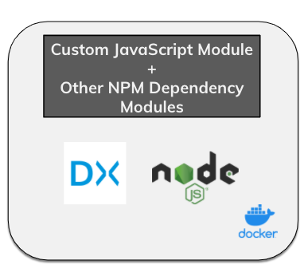
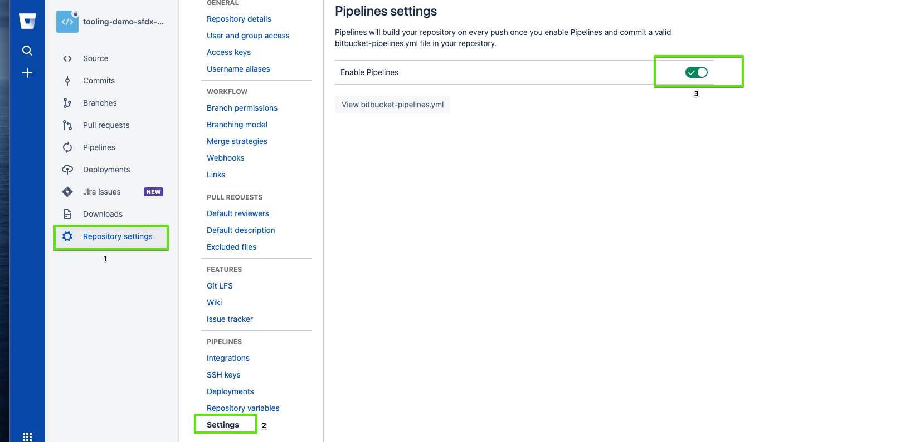
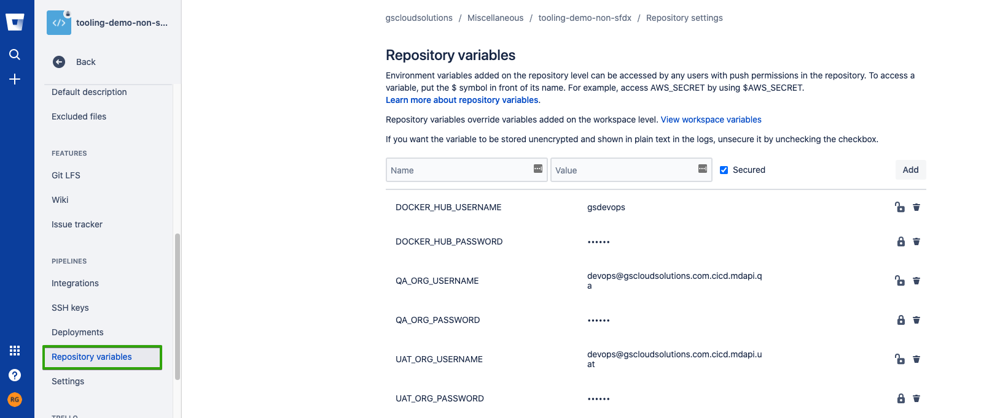

# GS DevOps Mate
## A free open source CI/CD Services Agnostic tool from Groundswell Cloud Solutions Inc. to make conventional CI/CD for Salesforce super easy!

# What it is?
A Dockerized NodeJS CLI App mostly wrapping the SFDX commands to effectively perform some of the CI/CD tasks



# The Big Picture


# Where does DevsOps Mate exists in a typical Release Systems Landscape?


# Why did we build it?

1. SFDX is a huge list of CLI commands meant to perform various actions on the Salesforce platform. But it's a huge list when it comes to perform actions related to CI/CD for the platform. We imagined this tool as a set of some pre-baked scripts to perform actions very specific to CI/CD for a DevOps team without getting into the nitty gritty of SFDX commands and without bothering about figuring out which ones are meant for the purpose of deployment, testing etc. and how to effectively combine them.
2. Having this tool as a Docker image allows us to utilize the same set of commands across various CI/CD services out there. It also provides us the liberty to have SFDX and bash available at any team's disposal to not only use our commands but the raw SFDX and bash ones if there is the need. Having a Docker image already available with all the dependencies also improves the performance instead of downloading the build related dependencies at the build time.
3. Being open source and everything in JS, you have all the liberty to add more features as long as you have a dev who knows basic NodeJs and JavaScript.
4. We do not want you to fill your build yaml files with a lot of cryptic bash script, instead now you have full NodeJS at your disposal to handle things in a more sophisticated way.

# Unique Benefits and Core Features


# Core Idea:

Typically CI/CD or a typical source control based build on Salesforce Core Platform revolved around 5 major activities:

1. Creating a Scratch Org
2. Create a deployable package<sup>1</sup>/artifact out of the Git repo (The repo can be in either of the SFDX or NON-SFDX/MDAPI format)
3. Validate<sup>2</sup>/Deploy the artifact
4. Running Tests<sup>3</sup>
5. Retrieve the org changes

**Note:** _You can read more about GS DevOps Mate and it's features in a series of blog posts here, watch this demo and also feel free to watch this webinar._

# For TL;DR: How to quickly set it up on your BitBucket Pipelines

## General Setup:

Enable the pipelines as shown below:


**Note:** _You must be an admin for the repository to make these configuration changes_

### Setup the deployment environments as shown below:
This is not a required step and can be skipped


### Setup the environment variables:
To setup environment variables for GS DevOps Mate, we rely on Repository Variables in BitBucket. 
Another benefit of Repository Variables is that you can also access them as variables in the YAML file.
To configure the Repository Variables click on Repository Variables tab once you are in the Repository Settings as shown below:


Here is a comprehensive list of repository variables that need to be used(all or most of them) in the Pipelines. Some of them are used internally by the tool as environment variables while others are used in the YAML. The variables which are used in YAML can be named something else as well baseed on your convenience but then make sure to refer the right names in the YAML. The quick start YAML we are providing here is based on the names we are suggesting. 

> **DOCKER_HUB_USERNAME:**
The username for the DockerHub, not required if the image is public. Used in YAML.
**DOCKER_HUB_PASSWORD:**
The password for the DockerHub, not required if the image is public. Make sure to select the **Secured** checkbox so that they are created as secret variables. Used in YAML.  
**LOGGING_LEVEL:**
The logging level, if this variable is not created, the default value would be info, other valid ones are fatal, error, warning, info, debug, trace. Used internally by the tool.  
**MIN_OVERALL_CODE_COVERAGE:**
Minimum coverage percentage required while validating/deploying the code and considered it to be successful. Can be anything from 75 to 100. If not created, default would be 100. Used internally by the tool.  
**LATEST_COMMIT_HASH_TAG:**
The latest commit HASH tag. Use 'HEAD' as the value if not sure. Used in YAML.  
**DEV_ORG_TYPE, QA_ORG_TYPE, UAT_ORG_TYPE, PROD_ORG_TYPE:**
Salesforce Orgs' types. Valid values are DEVELOPER, SANDBOX, SCRATCH, and PRODUCTION. Used in YAML.  
**DEV_ORG_USERNAME, QA_ORG_USERNAME, UAT_ORG_USERNAME, PROD_ORG_USERNAME:**
Salesforce Orgs' usernames. Used in YAML.  
**DEV_ORG_PASSWORD, QA_ORG_PASSWORD, UAT_ORG_PASSWORD, PROD_ORG_PASSWORD:** 
Salesforce Orgs' passwords. Make sure to select the **Secured** checkbox so that they are created as secret variables. Used in YAML.  
**TEST_LEVEL:**
Test levels. Used in YAML. Valid values are NoTestRun, RunLocalTests, RunSpecifictTest, RunAllTests. You can also define different test level for different deployment steps like QA_DEP_TEST_LEVEL, UAT_TEST_LEVEL, QA_VALIDATION_TEST_LEVEL etc. and assign any of the four values. For RunSpecifictTest, make sure to have a defrault test class and pass it as a param to the deployment command. You can see the example in YAMLs.  
**FULL_PACAKGE_CREATION:**
This variable needs to be created only for the package creation where diff is not calculated based on the last successful deployment in the Target Org. Used in YAML.  
**MAJOR_VERSION, MINOR_VERSION, PATCH:**
These three variables are also used to create a package version. Need to be created only for the package creation where diff is not calculated based on the last successful deployment in the Target Org. Used in YAML. You can check their usage in Gitflow Workflow YAMLs below.  
**GIT TAGS:**
Only required if your Pipeline relies on Git Tags to create a diff based package. Based on your orgs you should have a different Git Tag for each org like
CI_SUCCESS_TAG = CI_DEPLOYED, QA_SUCCESS_TAG = QA_DEPLOYED, UAT_SUCCESS_TAG = UAT_DEPLOYED etc.

### Setting up the Pipelines:
In BitBucket Pipelines a single YAML file is used to setup multiple pipelines. In the examples below we would be covering two Git Workflows for both SFDX and MDAPI format repos.
#### Gitflow Workflow:

For a detailed overview of Gitflow Workflow please check [here](https://www.atlassian.com/git/tutorials/comparing-workflows/gitflow-workflow).

Create a bitbucket-pipelines.yml file with the following YAML in main/master branch:

##### For SFDX Format Repo:
In this Git workflow, we will create the diff artifacts based on a Git Tags.

```
image:
  name: gscloudsolutions/devops-mate:stable # Referencing the public image from Docker Hub
  #username: $DOCKER_HUB_USERNAME #Username-password not required
  #password: $DOCKER_HUB_PASSWORD

pipelines:
  pull-requests:
    feature/*: #any branch with a feature prefix
      - step:
          name: Creating Deployment Package for CI(Continuous Integration)
          script:
            - echo 'Creating an artifact/package'
            - sfPackages source-combined -f $FULL_PACKAGE_CREATION -v $MAJOR_VERSION.$MINOR_VERSION.$PATCH.$BITBUCKET_BUILD_NUMBER -p $BITBUCKET_CLONE_DIR -n $LATEST_COMMIT_HASH_TAG -o $QA_SUCCESS_TAG || if test $? -eq 21; then exit 0; else exit 1; fi
          artifacts:
            - Artifacts/**
      - step:
          name: Deployment Validation On QA/Partial-Dev Org/Environment
          script:
            - echo 'Deployment Validation On QA/Partial-Dev Org.'
            - sfDeploy mdapipackage -l $TEST_LEVEL -p $BITBUCKET_CLONE_DIR -c true -u "$QA_ORG_USERNAME" -s "$QA_ORG_PASSWORD" -t $QA_ORG_TYPE -v $MAJOR_VERSION.$MINOR_VERSION.$PATCH.$BITBUCKET_BUILD_NUMBER
          artifacts:
            - Artifacts/**
  branches:
    # Pipeline for develop branch
    'develop': # This step is required as the first step can not be manual under a BB pipeline
      - step:
          name: QA Org Deployment Intialization
          script:
            - echo 'Initialization for QA Org Deployment'
      #QA Org Deployment
      - step:
          name: QA Org Deployment
          deployment: QAOrg
          trigger: manual
          script:
            - echo 'Creating an artifact/package'
            - sfPackages source-combined -f $FULL_PACKAGE_CREATION -v $MAJOR_VERSION.$MINOR_VERSION.$PATCH.$BITBUCKET_BUILD_NUMBER -p $BITBUCKET_CLONE_DIR -n $LATEST_COMMIT_HASH_TAG -o $QA_SUCCESS_TAG || if test $? -eq 21; then exit 0; else exit 1; fi
            - echo 'Deployment On QA Org.'
            - sfDeploy mdapipackage -l $TEST_LEVEL -p $BITBUCKET_CLONE_DIR -u "$QA_ORG_USERNAME" -s "$QA_ORG_PASSWORD" -t $QA_ORG_TYPE -v $MAJOR_VERSION.$MINOR_VERSION.$PATCH.$BITBUCKET_BUILD_NUMBER
            - echo "After deployment cleanup"
            - git tag -f $QA_SUCCESS_TAG
            - git push -f --tags
      #Automated step as BB Pipeline can not start with a manual step
      - step:
          name: Feature Ready for UAT
          script:
            - echo 'Ready for UAT'
      #UAT Org Deployment
      - step:
          name: UAT Org Deployment
          deployment: UATOrg
          trigger: manual
          script:
            - echo 'Creating an artifact/package'
            - sfPackages source-combined -f $FULL_PACKAGE_CREATION -v $MAJOR_VERSION.$MINOR_VERSION.$PATCH.$BITBUCKET_BUILD_NUMBER -p $BITBUCKET_CLONE_DIR -n $LATEST_COMMIT_HASH_TAG -o $UAT_SUCCESS_TAG  || if test $? -eq 21; then exit 0; else exit 1; fi
            - echo 'Deployment On UAT Org.'
            - sfDeploy mdapipackage -l $TEST_LEVEL -p $BITBUCKET_CLONE_DIR -u "$UAT_ORG_USERNAME" -s "$UAT_ORG_PASSWORD" -t $UAT_ORG_TYPE -v $MAJOR_VERSION.$MINOR_VERSION.$PATCH.$BITBUCKET_BUILD_NUMBER
            - echo "After deployment cleanup"
            - git tag -f $UAT_SUCCESS_TAG
            - git push -f --tags

    # Pipeline for release branch
    'release/*':
      #Prod Org Deployment Validation
      - step:
          name: Prod Org Deployment Validation
          script:
            - echo 'Creating a Git Diff based artifact/package'
            - sfPackages source-combined -f $FULL_PACKAGE_CREATION -v $MAJOR_VERSION.$MINOR_VERSION.$PATCH.$BITBUCKET_BUILD_NUMBER -p $BITBUCKET_CLONE_DIR -n $LATEST_COMMIT_HASH_TAG -o $PROD_SUCCESS_TAG || if test $? -eq 21; then exit 0; else exit 1; fi
            - echo 'Deployment Validation On Prod Org.'
            - sfDeploy mdapipackage -l $TEST_LEVEL -p $BITBUCKET_CLONE_DIR -u "$PROD_ORG_USERNAME" -s "$PROD_ORG_PASSWORD" -t $PROD_ORG_TYPE -v $MAJOR_VERSION.$MINOR_VERSION.$PATCH.$BITBUCKET_BUILD_NUMBER -c true

    # Pipeline for main branch
    'main':
      #Prod Org Deployment Validation
      - step:
          name: Prod Org Deployment Validation
          script:
            - echo 'Creating a Git Diff based artifact/package'
            - sfPackages source-combined -f $FULL_PACKAGE_CREATION -v $MAJOR_VERSION.$MINOR_VERSION.$PATCH.$BITBUCKET_BUILD_NUMBER -p $BITBUCKET_CLONE_DIR/$PROD_PACKAGE_DIR -n $LATEST_COMMIT_HASH_TAG -o $PROD_SUCCESS_TAG || if test $? -eq 21; then exit 0; else exit 1; fi
            - echo 'Deployment Validation On Prod Org.'
            - sfDeploy mdapipackage -l $TEST_LEVEL -p $BITBUCKET_CLONE_DIR/$PROD_PACKAGE_DIR -u "$PROD_ORG_USERNAME" -s "$PROD_ORG_PASSWORD" -t $PROD_ORG_TYPE -v $MAJOR_VERSION.$MINOR_VERSION.$PATCH.$BITBUCKET_BUILD_NUMBER -c true
      #Prod Org Deployment
      - step:
          name: Prod Org Deployment
          deployment: ProdOrg
          trigger: manual
          script:
            - echo 'Creating a Git Diff based artifact/package'
            - sfPackages source-combined -f $FULL_PACKAGE_CREATION -v $MAJOR_VERSION.$MINOR_VERSION.$PATCH.$BITBUCKET_BUILD_NUMBER -p $BITBUCKET_CLONE_DIR -n $LATEST_COMMIT_HASH_TAG -o $PROD_SUCCESS_TAG || if test $? -eq 21; then exit 0; else exit 1; fi
            - echo 'Deployment On Prod Org.'
            - sfDeploy mdapipackage -l $TEST_LEVEL -p $BITBUCKET_CLONE_DIR -u "$PROD_ORG_USERNAME" -s "$PROD_ORG_PASSWORD" -t $PROD_ORG_TYPE -v $MAJOR_VERSION.$MINOR_VERSION.$PATCH.$BITBUCKET_BUILD_NUMBER
            - echo "After deployment cleanup"
            - git tag -f $PROD_SUCCESS_TAG
            - git push -f --tags
          artifacts:
            - Artifacts/**


  custom: # Pipelines that can only be triggered manually or can be scheduled
    PullAndCommitMyChangeSet:
      - variables:  #list variable names under here
          - name: CHANGESET_NAME
          - name: COMMIT_MESSAGE
          - name: BRANCH_NAME
      - step:
          name: Checkout a git branch
          script:
            - echo 'Checking out git branch'
            - pwd
            - echo $BITBUCKET_CLONE_DIR
            - echo $CHANGESET_NAME
            - echo $COMMIT_MESSAGE
            - echo $BRANCH_NAME
            - ls -a
            - git checkout -b "feature/$BRANCH_NAME"
            - echo 'Pulling changeset and commiting it to checked out branch'
            - sfRetrieve src-format -u "$DEV_ORG_USERNAME" -s "$DEV_ORG_PASSWORD" -t $DEV_ORG_TYPE -n "$CHANGESET_NAME" -p $BITBUCKET_CLONE_DIR
            - ls -a
            - git add --all
            - git commit -m "$COMMIT_MESSAGE"
            - git push
    DeployParticularCommit:
      - variables:  #list variable names under here
          - name: COMMIT_HASH_OR_TAG
      - step:
          name: Create Artifact
          script:
            - echo 'Creating a Git Diff based artifact/package'
            - sfPackages source-combined -p $BITBUCKET_CLONE_DIR -n "$COMMIT_HASH_OR_TAG" -o "$COMMIT_HASH_OR_TAG~1" -v 1.0.0.$BITBUCKET_BUILD_NUMBER || if test $? -eq 21; then exit 0; else exit 1; fi
          artifacts:
            - Artifacts/**
      - step:
          name: Deploy Artifact
          script:
            - echo 'Deploying Artifact'
            - sfDeploy mdapipackage -p $BITBUCKET_CLONE_DIR -u "$QA_ORG_USERNAME" -s "$QA_ORG_PASSWORD" -t $QA_ORG_TYPE -v 1.0.0.$BITBUCKET_BUILD_NUMBER -l RunLocalTests
```

##### For MDAPI Format Repo:
In this Git workflow, we will create the diff artifacts based on a Git Tags.

```
image:
  name: gscloudsolutions/devops-mate:stable #Referencing the public image from Docker Hub
  #username: $DOCKER_HUB_USERNAME #Username-password not required
  #password: $DOCKER_HUB_PASSWORD

pipelines:
  pull-requests:
      feature/*: #any branch with a feature prefix
        - step:
            name: Creating Deployment Package for CI(Continuous Integration)/QA Environment/Org
            script:
              - echo 'Creating a Git Diff based artifact/package'
              - sfPackages mdapi -f $FULL_PACKAGE_CREATION -v $MAJOR_VERSION.$MINOR_VERSION.$PATCH.$BITBUCKET_BUILD_NUMBER -p $BITBUCKET_CLONE_DIR -n $LATEST_COMMIT_HASH_TAG -o $QA_SUCCESS_TAG || if test $? -eq 21; then exit 0; else exit 1; fi
            artifacts:
              - Artifacts/**
        - step:
            name: Deployment Validation On QA/CI Environment
            script:
              - echo 'Deployment Validation On QA/CI Environment'
              - sfDeploy mdapipackage -l $TEST_LEVEL -p $BITBUCKET_CLONE_DIR -c true -u "$QA_ORG_USERNAME" -s "$QA_ORG_PASSWORD" -t $QA_ORG_TYPE -v $MAJOR_VERSION.$MINOR_VERSION.$PATCH.$BITBUCKET_BUILD_NUMBER
            artifacts:
              - Artifacts/**
  branches:
    # Pipeline for develop branch
    'develop':
      #QA Org Deployment
      - step:
          name: QA Org Deployment
          deployment: QAOrg
          #trigger: manual
          script:
            - echo 'Creating a Git Diff based artifact/package'
            - sfPackages mdapi -f $FULL_PACKAGE_CREATION -v $MAJOR_VERSION.$MINOR_VERSION.$PATCH.$BITBUCKET_BUILD_NUMBER -p $BITBUCKET_CLONE_DIR -n $LATEST_COMMIT_HASH_TAG -o $QA_SUCCESS_TAG || if test $? -eq 21; then exit 0; else exit 1; fi
            - echo 'Deployment On QA Org.'
            - sfDeploy mdapipackage -l $TEST_LEVEL -p $BITBUCKET_CLONE_DIR -u "$QA_ORG_USERNAME" -s "$QA_ORG_PASSWORD" -t $QA_ORG_TYPE -v $MAJOR_VERSION.$MINOR_VERSION.$PATCH.$BITBUCKET_BUILD_NUMBER
            - echo "After deployment cleanup"
            - git tag -f $QA_SUCCESS_TAG
            - git push -f --tags
      #Automated step as BB Pipeline can not start with a manual step
      - step:
          name: Feature Ready for UAT
          script:
            - echo 'Ready for UAT'
      #UAT Org Deployment
      - step:
          name: UAT Org Deployment
          deployment: UATOrg
          trigger: manual
          script:
            - echo 'Creating a Git Diff based artifact/package'
            - sfPackages mdapi -f $FULL_PACKAGE_CREATION -v $MAJOR_VERSION.$MINOR_VERSION.$PATCH.$BITBUCKET_BUILD_NUMBER -p $BITBUCKET_CLONE_DIR -n $LATEST_COMMIT_HASH_TAG -o $UAT_SUCCESS_TAG  || if test $? -eq 21; then exit 0; else exit 1; fi
            - echo 'Deployment On UAT Org.'
            - sfDeploy mdapipackage -l $TEST_LEVEL -p $BITBUCKET_CLONE_DIR -u "$UAT_ORG_USERNAME" -s "$UAT_ORG_PASSWORD" -t $UAT_ORG_TYPE -v $MAJOR_VERSION.$MINOR_VERSION.$PATCH.$BITBUCKET_BUILD_NUMBER
            - echo "After deployment cleanup"
            - git tag -f $UAT_SUCCESS_TAG
            - git push -f --tags

    # Pipeline for release branch
    'release/*':
      #Prod Org Deployment Validation
      - step:
          name: Prod Org Deployment Validation
          script:
            - echo 'Creating a Git Diff based artifact/package'
            - sfPackages mdapi -f $FULL_PACKAGE_CREATION -v $MAJOR_VERSION.$MINOR_VERSION.$PATCH.$BITBUCKET_BUILD_NUMBER -p $BITBUCKET_CLONE_DIR -n $LATEST_COMMIT_HASH_TAG -o $PROD_SUCCESS_TAG || if test $? -eq 21; then exit 0; else exit 1; fi
            - echo 'Deployment Validation On Prod Org.'
            - sfDeploy mdapipackage -l $TEST_LEVEL -p $BITBUCKET_CLONE_DIR -u $PROD_ORG_USERNAME -s "$PROD_ORG_PASSWORD" -t "$PROD_ORG_TYPE" -v $MAJOR_VERSION.$MINOR_VERSION.$PATCH.$BITBUCKET_BUILD_NUMBER -c true

    # Pipeline for main branch
    'main':
      #Prod Org Deployment Validation
      - step:
          name: Prod Org Deployment Validation
          script:
            - echo 'Creating a Git Diff based artifact/package'
            - sfPackages mdapi -f $FULL_PACKAGE_CREATION -v $MAJOR_VERSION.$MINOR_VERSION.$PATCH.$BITBUCKET_BUILD_NUMBER -p $BITBUCKET_CLONE_DIR -n $LATEST_COMMIT_HASH_TAG -o $PROD_SUCCESS_TAG || if test $? -eq 21; then exit 0; else exit 1; fi
            - echo 'Deployment Validation On Prod Org.'
            - sfDeploy mdapipackage -l $TEST_LEVEL -p $BITBUCKET_CLONE_DIR -u "$PROD_ORG_USERNAME" -s "$PROD_ORG_PASSWORD" -t $PROD_ORG_TYPE -v $MAJOR_VERSION.$MINOR_VERSION.$PATCH.$BITBUCKET_BUILD_NUMBER -c true
      #Prod Org Deployment
      - step:
          name: Prod Org Deployment
          deployment: ProdOrg
          trigger: manual
          script:
            - echo 'Creating a Git Diff based artifact/package'
            - sfPackages mdapi -f $FULL_PACKAGE_CREATION -v $MAJOR_VERSION.$MINOR_VERSION.$PATCH.$BITBUCKET_BUILD_NUMBER -p $BITBUCKET_CLONE_DIR -n $LATEST_COMMIT_HASH_TAG -o $PROD_SUCCESS_TAG || if test $? -eq 21; then exit 0; else exit 1; fi
            - echo 'Deployment On Prod Org.'
            - sfDeploy mdapipackage -l $TEST_LEVEL -p $BITBUCKET_CLONE_DIR -u "$PROD_ORG_USERNAME" -s "$PROD_ORG_PASSWORD" -t $PROD_ORG_TYPE -v $MAJOR_VERSION.$MINOR_VERSION.$PATCH.$BITBUCKET_BUILD_NUMBER
            - echo "After deployment cleanup"
            - git tag -f $PROD_SUCCESS_TAG
            - git push -f --tags
          artifacts:
            - Artifacts/**
  

  custom: # Pipelines that can only be triggered manually or can be scheduled
    PullAndCommitMyChangeSet:
      - variables:  #list variable names under here
          - name: CHANGESET_NAME
          - name: COMMIT_MESSAGE
          - name: BRANCH_NAME
      - step:
          name: Checkout a git branch
          script:
            - echo 'Checking out git branch'
            - pwd
            - echo $BITBUCKET_CLONE_DIR
            - echo $CHANGESET_NAME
            - echo $COMMIT_MESSAGE
            - echo $BRANCH_NAME
            - ls -a
            - git checkout -b "feature/$BRANCH_NAME"
            - echo 'Pulling changeset and commiting it to checked out branch'
            - sfRetrieve src-format -u $DEV_ORG_USERNAME -s "$DEV_ORG_PASSWORD" -t "$DEV_ORG_TYPE" -n "$CHANGESET_NAME" -p $BITBUCKET_CLONE_DIR
            - ls -a
            - git add --all
            - git commit -m "$COMMIT_MESSAGE"
            - git push
    DeployParticularCommit:
      - variables:  #list variable names under here
          - name: COMMIT_HASH_OR_TAG
      - step:
          name: Create Artifact
          script:
            - echo 'Creating a Git Diff based artifact/package'
            - sfPackages mdapi -p $BITBUCKET_CLONE_DIR -n "$COMMIT_HASH_OR_TAG" -o "$COMMIT_HASH_OR_TAG~1" -v 1.0.0.$BITBUCKET_BUILD_NUMBER || if test $? -eq 21; then exit 0; else exit 1; fi
          artifacts:
            - Artifacts/**
      - step:
          name: Deploy Artifact
          script:
            - echo 'Deploying Artifact'
            - sfDeploy mdapipackage -p $BITBUCKET_CLONE_DIR -u "$QA_ORG_USERNAME" -s "$QA_ORG_PASSWORD" -t $QA_ORG_TYPE -v 1.0.0.$BITBUCKET_BUILD_NUMBER -l RunLocalTests
```

# Core Commands:

## Scratch Org Creation:

## Artifact Creation:

**Note:** _All the commands for 'Artifact Creation' can work as independent commands or can work in conjunction with 'sfDeploymentInfo get' command_

### `sfDeploymentInfo get`
#### Description:
This command when runs against a target org, get the org state in terms of what is the last commit SHA/tag related to the successful deployment. This commit sha info in turn can be used by the artifact creation commands to do the Git diff against a newer commit passed as a required parameter.  
#### Parameters:  
**-n --module:** Module name to get it's latest state in the target. Only required with a SFDX multi-module repo and that too when a different artifact is to be created for each module. For all other use cases, any string value can be passed. TODO: Need to make it optional.  
**-u --targetUsername:** Username or alias for the target org. Alias can only be used if the target org is already authenticated with one of the tooling's or sfdx authentication commands.  
**-s --password:** Password for the target org. If your build service's IP is not whitelisted, please make sure to append the security token as well to the password. Please refer here on how to generate security token.(Required if username is passed, do not pass if alisa is being used)  
**-i --buildId:** Any unique identifier which is unique to every build. Typically can be the build number or id based on the CI/CD service being used.(Required) TODO: To make it optional.  
**-t --envType:** Type of the Org, Accepted values: SANDBOX, PRODUCTION, DEVELOPER or SCRATCH  
#### How to use:  
Please check 'How to use' section in the sfPackages mdapi command details.

Now let's look into the Artifact Creation commands:

### `sfPackages mdapi`
#### Description:
This command is used to create an artifact from a mdapi/non-sfdx format Git repo. Supports artifact creation from the whole repo or between any two any commits.
#### Parameters:   
-n --newCommit: Any commit SHA or Git tag.(Required if old commit is passed or this command is used in conjunction with the 'sfDeploymentInfo get' command). Make sure this should be a newer commit than the commit SHA passed in old commit. TODO: Make it optional even in case of an old commit param is passed or 'sfDeploymentInfo get' command is used. HEAD would be the default value in that case.  
-o --oldCommit: Any commit SHA or Git tag (Optional). Only use this parameter when the command is not used in conjunction with 'sfDeploymentInfo get' command. Make sure this should be an older commit than the commit SHA passed in new commit. If you want to create a package all the way from the very first commit to the commit passed in new commit param, every time, neither use this param, nor use the 'sfDeploymentInfo get' command.  
-p --artifactsLocation: The path where generated artifact would be stored. This would typically be the working directory of the CI/CD service. You can also add a name for your own folder to the working directory path and the command will take care of creating this folder in the path provided.(Required) TODO: Figure out a way to make this parameter optional at least for a set of CI/CD services like Azure DevOps, Cricle CI, BB Pipelines, CodeFresh and GitLabs.  
-i --buildId: Any unique identifier which is unique to every build. Typically can be the build number or id based on the CI/CD service being used. Required, if this command is used in conjunction with the 'sfDeploymentInfo get' command. Else, would be ignored.  
-v --packageVersion: Custom version for of an artifact. This is required if the command is not used in conjunction with 'sfDeploymentInfo get' command.  
#### How to use:   
##### Without Old commit or using 'sfDeploymentInfo get' as a command before sfPackage command(full artifact creation will happen in this case):  
`sfPackages mdapi -p <CI/CD Service Working Directory Path>/<CI/CD Service Working Directory Path/Folder name of your choice> -n HEAD -v <Version Number>  `  
                                  or  
`sfPackages mdapi -p <CI/CD Service Working Directory Path>/<CI/CD Service Working Directory Path/Folder name of your choice> -v <Version Number> `  
##### Examples:  
###### BitBucket Pipelines: 
`sfPackages mdapi -p $BITBUCKET_CLONE_DIR/$PACKAGE_DIR -n HEAD -v 1.0.$BITBUCKET_BUILD_NUMBER`  
BITBUCKET\_CLONE\_DIR (Standard Pipeline Variable): Represents path of the working directory in BB Pipelines in which the repo is cloned.  
BITBUCKET\_BUILD\_NUMBER (Standard Pipeline Variable): Build number  
PACKAGE\_DIR (Custom Pipeline Variable): You can have any name for this variable like QA\_PACAAKGE\_DIR or PROD\_PCKG\_DIR etc. and the value also would be the directory name of your choice like PackageDir, QAPckgDir etc. 
##### With Old commit (Will create a Git diff based artifact based on the new and old commits passed as param): 
`sfPackages mdapi -p <CI/CD Service Working Directory Path>/<CI/CD Service Working Directory Path/Folder name of your choice> -n HEAD -o <Git Tag or Commit SHA from some older commit> -v <Version Number>`  
##### Examples:   
###### BitBucket Pipelines:  
`sfPackages mdapi -p $BITBUCKET_CLONE_DIR/$PACKAGE_DIR -n HEAD -v 1.0.$BITBUCKET_BUILD_NUMBER -o $OLD_COMMIT_TAG`  
BITBUCKET\_CLONE\_DIR (Standard Pipeline Variable): Represents path of the working directory in BB Pipelines in which the repo is cloned.  
BITBUCKET\_BUILD\_NUMBER (Standard Pipeline Variable): Build number  
PACKAGE\_DIR (Custom Pipeline Variable): You can have any name for this variable like QA\_PACAAKGE\_DIR or PROD\_PCKG\_DIR etc. and the value also would be the directory name of your choice like PackageDir, QAPckgDir etc.  
PRVS\_COMMIT\_TAG (Custom Pipeline Variable): You can have any name for this variable like INT\_COMMIT\_TAG, OLD\_COMMIT\_TAG, QA\_COMMIT\_TAG etc. and the value also would be the tag name that you decided to tag the commit after successful deployment like INT\_DEPLOYED, QA\_DEPLOYED, DEPLOYED etc.  

##### With 'sfDeploymentInfo get' command:  
Will create a Git diff based artifact based on the new and old commits, where old commit would be based on the old commit SHA stored in the target Org, if could not find the SHA, a full artifact will get created which is fine as no commit SHA in the target Org signifies no successful deployment happened before or it is the first deployment. In such a case the artifact anyways should be created from the very first commit till the new commit up to which you want to deploy. Once the successful deployment, the deploy command if could not find the Old Commit Info, it not only creates the info record but first deploys the Custom Settings Object meant to hold this info and then creates the record)  
`sfDeploymentInfo get -u <Target Org Username> -s <Target Org Password> -t <Target Org Type> -i <Unique Identifier for the Build> -n All`  
`sfPackages mdapi -p <CI/CD Service Working Directory Path>/<CI/CD Service Working Directory Path/Folder name of your choice> -n <GIT Commit SHA Or Tag> -i <Unique Identifier for the Build>`  
#### Examples:    
##### BitBucket Pipelines:  
`sfDeploymentInfo get -u $QA_ORG_USERNAME -t $QA_ORG_TYPE -i $BITBUCKET_BUILD_NUMBER -n All -s $QA_ORG_PASSWORD`  
`sfPackages mdapi -p $BITBUCKET_CLONE_DIR/$QA_PACKAGE_DIR -n $LATEST_COMMIT_HASH_TAG -i $BITBUCKET_BUILD_NUMBER`
BITBUCKET\_CLONE\_DIR (Standard Pipeline Variable): Represents path of the working directory in BB Pipelines in which the repo is cloned.  
BITBUCKET\_BUILD\_NUMBER (Standard Pipeline Variable): Build number
PACKAGE\_DIR (Custom Pipeline Variable): You can have any name for this variable like QA\_PACAAKGE\_DIR or PROD\_PCKG\_DIR etc. and the value also would be the directory name of your choice like PackageDir, QAPckgDir etc.  
LATEST\_COMMIT\_HASH\_TAG (Custom Pipeline variable): Value for this variable can be any Git SHA or Tag, Typically value would be 'HEAD'  
All other variables are also custom Pipeline variables and are self-explanatory   

### `sfPackages source-combined`  
#### Description:
This command is used to create an artifact from a source/sfdx format Git repo. If the repo consists of multiple modules, the metadata from all of them will be combined in the artifact. Supports artifact creation from the whole repo or between any two any commits.  
#### Parameters:   
-n --newCommit: Any commit SHA or Git tag.(Required if old commit is passed or this command is used in conjunction with the 'sfDeploymentInfo get' command). Make sure this should be a newer commit than the commit SHA passed in old commit. TODO: Make it optional even in case of an old commit param is passed or 'sfDeploymentInfo get' command is used. HEAD would be the default value in that case.  
-o --oldCommit: Any commit SHA or Git tag (Optional). Only use this parameter when the command is not used in conjunction with 'sfDeploymentInfo get' command. Make sure this should be an older commit than the commit SHA passed in new commit. If you want to create a package all the way from the very first commit to the commit passed in new commit param, every time, neither use this param, nor use the 'sfDeploymentInfo get' command.  
-p --artifactsLocation: The path where generated artifact would be stored. This would typically be the working directory of the CI/CD service. You can also add a name for your own folder to the working directory path and the command will take care of creating this folder in the path provided.(Required) TODO: Figure out a way to make this parameter optional at least for a set of CI/CD services like Azure DevOps, Cricle CI, BB Pipelines, CodeFresh and GitLabs.  
-i --buildId: Any unique identifier which is unique to every build. Typically can be the build number or id based on the CI/CD service being used. Required, if this command is used in conjunction with the 'sfDeploymentInfo get' command. Else, would be ignored.  
-v --packageVersion: Custom version for of an artifact. This is required if the command is not used in conjunction with 'sfDeploymentInfo get' command.  
#### How to use:   
Same as 'sfPackages mdapi' command  
#### Examples:    
Same as 'sfPackages mdapi' command

### sfPackages source-multi
#### Description
This command is used to create an artifact from a multi-modular source/sfdx format Git repo. It creates a separate artifact for each module. Supports artifact creation from the whole repo or between any two any commits. The motivation behind this command is to support modular deployments and let a team release it's features without waiting for other teams. There is some work needed to be done on this command in terms of how to manage these artifacts and their deployments, also from a process point of view. This command is more for experimental use now.  
#### Parameters:  
-n --newCommit: Any commit SHA or Git tag.(Required if old commit is passed or this command is used in conjunction with the 'sfDeploymentInfo get' command). Make sure this should be a newer commit than the commit SHA passed in old commit. TODO: Make it optional even in case of an old commit param is passed or 'sfDeploymentInfo get' command is used. HEAD would be the default value in that case.  
-o --oldCommit: Any commit SHA or Git tag (Optional). Only use this parameter when the command is not used in conjunction with 'sfDeploymentInfo get' command. Make sure this should be an older commit than the commit SHA passed in new commit. If you want to create a package all the way from the very first commit to the commit passed in new commit param, every time, neither use this param, nor use the 'sfDeploymentInfo get' command.  
-p --artifactsLocation: The path where generated artifact would be stored. This would typically be the working directory of the CI/CD service. You can also add a name for your own folder to the working directory path and the command will take care of creating this folder in the path provided.(Required) TODO: Figure out a way to make this parameter optional at least for a set of CI/CD services like Azure DevOps, Cricle CI, BB Pipelines, CodeFresh and GitLabs.  
-i --buildId: Any unique identifier which is unique to every build. Typically can be the build number or id based on the CI/CD service being used. Required, if this command is used in conjunction with the 'sfDeploymentInfo get' command. Else, would be ignored.  
-v --packageVersion: Custom version for of an artifact. This is required if the command is not used in conjunction with 'sfDeploymentInfo get' command.  
#### How to use:  
Same as 'sfPackages mdapi' command  
#### Examples:   
Same as 'sfPackages mdapi' command  

## Deployment:

### `sfDeploy mdapi`  
#### Description:
This command is used to do the deployment validation or deploy the artifact created by any of the commands discussed above to a Salesforce Org. This command works in conjunction with any of the artifact creation command or if the artifact is created and stored as an artifactory provided by the CI/CD service. We will talk more about the artifactory part in a later section.
#### Parameters:   
-p --artifactPath: The location where the artifact is being created by any of the artifact creation commands (Required)   
-v --artifactversion: The version of the artifact to be deployed. Only required if artifact version is being passed in the previous artifact creation command as well.Typically not required if artifact creation is based on the commit info gathered from the target org.  
-u --username: Username of the target org in which the artifact needs to be validated or deployed. Not required if the target org is already authenticated via JWT or URL Auth flow.  
-s --password: Password for the target org in which the artifact needs to be validated or deployed. Not required if the target org is already authenticated via JWT or URL Auth flow.  
-t --envType: The environment type of target Org. Either SANDBOX, PRODUCTION, DEVELOPER or SCRATCH. Not required if the target org is already authenticated via JWT or URL Auth flow.  
-a --targetUserName: The username/alias for the target Org that is already authenticated via JWT.  
-c --validate: Specifies either artifact validation or deployment. Deployment validation does not actually save the code/config to the target org but a nice way to figure out any issues in terms of missing dependencies, features to enable for the metadata in the package to be deployed and running apex tests.  
\-l \-\-testlevel: \(NoTestRun\|RunLocalTests\|RunAllTestsInOrg\) deployment testing level\. TODO: Support for RunSpecified tests\, in this case\, the command will look for any test suite from the artifact and run the test classes from it\.  
-r --successSHA: The commit SHA or Git Tag that is being passed to the 'n(new)' parameter in the artifact creation command used before this command. This param needed to be passed only if artifact creation is based on the commit info gathered from the target org. TODO: Check if this param is not passed, would HEAD be considered.  
-i --buildId: The unique identifier that is being passed to the 'i(buildId)' parameter in the artifact creation command used before this command. This param needed to be passed only if artifact creation is based on the commit info gathered from the target org.  
#### Examples:    
##### BitBucket Pipelines:  
##### Deployment Validation:  
`sfDeploy mdapipackage -p $BITBUCKET_CLONE_DIR/$QA_PACKAGE_DIR -c true -u $QA_ORG_USERNAME -s $QA_ORG_PASSWORD -t $QA_ORG_TYPE --successSHA $LATEST_COMMIT_HASH_TAG -i $BITBUCKET_BUILD_NUMBER`  
###### Deployment without version parameter:  
`sfDeploy mdapipackage -p $BITBUCKET_CLONE_DIR/$QA_PACKAGE_DIR -u $QA_ORG_USERNAME -s $QA_ORG_PASSWORD -t $QA_ORG_TYPE --successSHA $LATEST_COMMIT_HASH_TAG -i $BITBUCKET_BUILD_NUMBER`  
##### Deployment with version parameter:  
`sfDeploy mdapipackage -p $BITBUCKET_CLONE_DIR/$QA_PACKAGE_DIR -u $QA_ORG_USERNAME -s $QA_ORG_PASSWORD -t $QA_ORG_TYPE -v 1.0.$BITBUCKET_BUILD_NUMBER`  
Please refer to the examples above for Pipeline variables.  

# Roadmap:

### High Priority: :rocket:
- [ ] Support for PMD based Static Code Analysis for Apex and VF
- [ ] Support for ESLint based Static Code Analysis for LWCs
- [ ] Enhancements to ChangeSet Retrieval to support Custom Objects in MDAPI format and Custom Labels, Workflows and Profiles in both MDAPI and Source(SFDX) format
- [ ] Eager Artifact Picking to release branches

### Medium Priority: :airplane:
- [ ] Package Manifest Generation Command
- [ ] Support for more than 10K metadata retrieval

### Good to Have: :car:
- [ ] Org compare based deployments

<sup>1</sup>_Packages here do not mean Second Generation or First Generation Packages of any kind. Instead, package or artifact here is referring to a folder containing one or more metadata with a package manifest file (package.xml) and this folder can be deployed to a Salesforce org if all the required dependencies and features for the metadata in this folder are there in that Org. From here on, we will refer to this SF deployable folder as an Artifact for the sake of clarity, but the commands in the tooling will still refer it as package. At some point, we will change such command names, it's in the TODO list.  
<sup>2</sup>Validation include steps like static code analysis, tests run, instead of just the deployment validation on a Salesforce Org. Deployment validation is a nice way to figure out any issues in terms of missing dependencies, features to enable for the metadata in the package to be deployed and running apex tests without actually saving the code in the target org.  
<sup>3</sup>This includes Apex tests, LWC/Aura Components JS Tests and UI Automation tests. Please note that UI Automation tests can not be run as part of the deployment validation step. They need the config and code to be actually deployed to run._  
